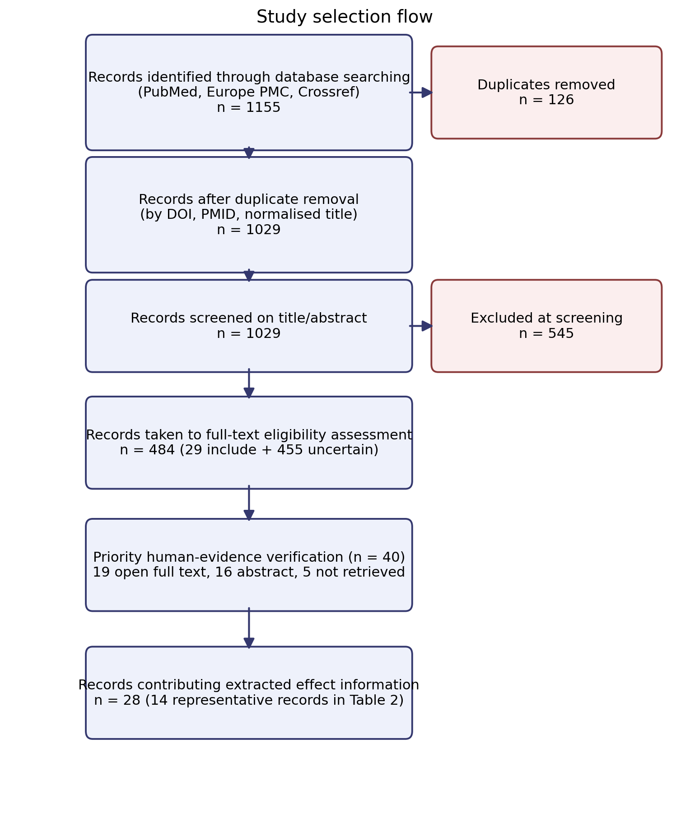
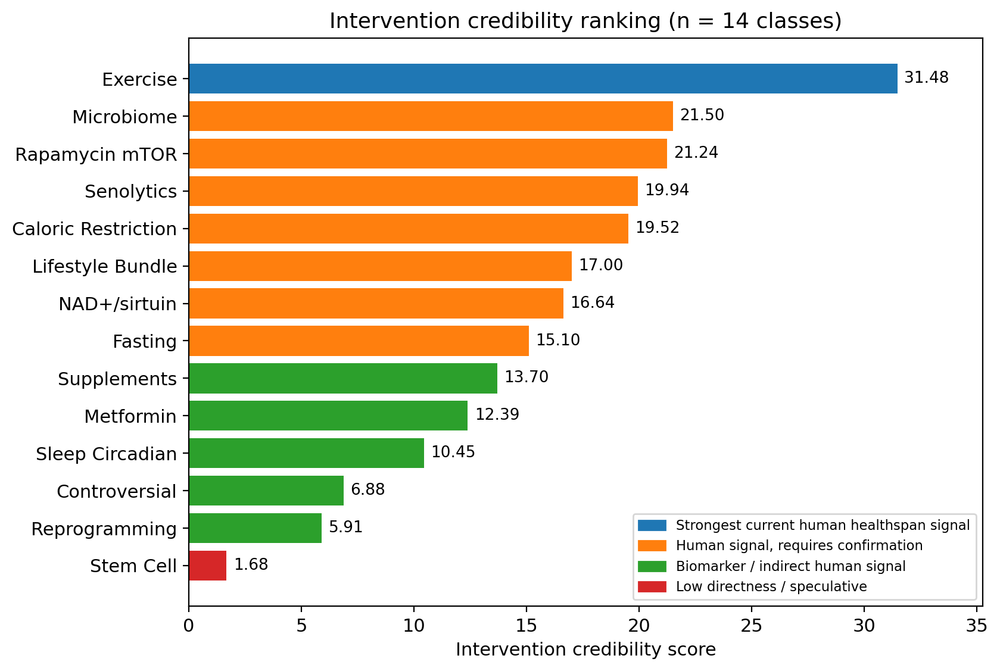
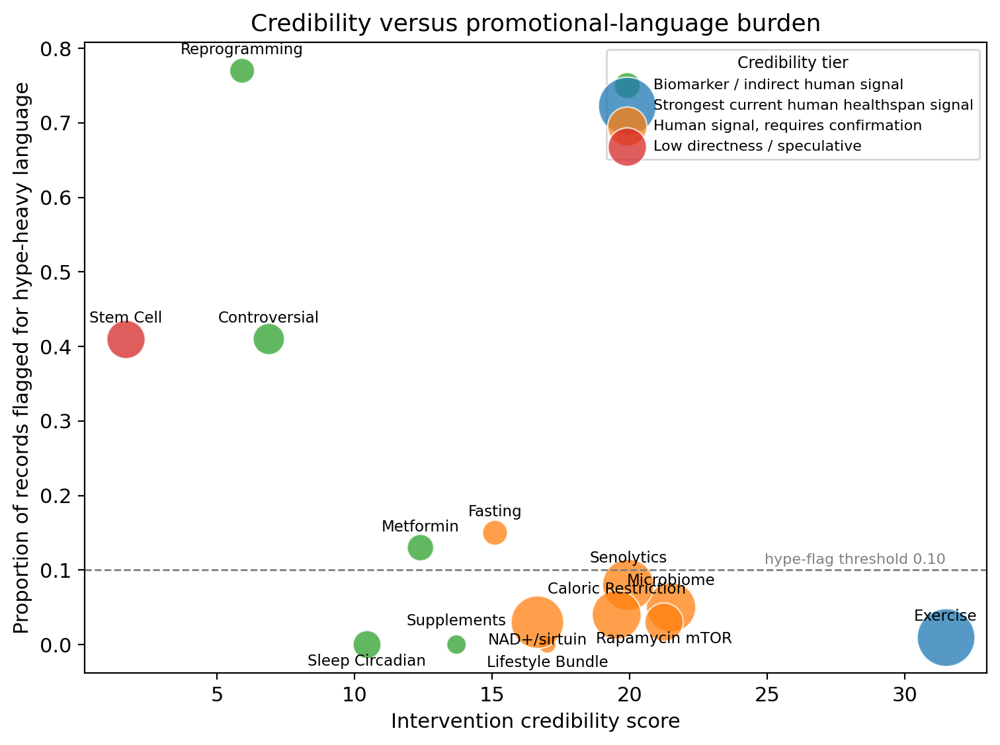
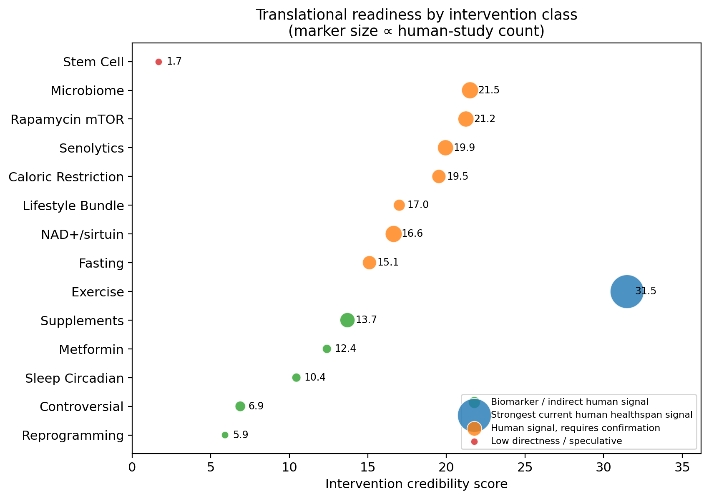

**Figures — Can Ageing Be Slowed or Reversed? A Reproducible Evidence Map and Credibility Ranking of Anti-Ageing and Age-Reversal Interventions**

Manuscript mjdrdypu_451_26 — Revision R1. Four figures (Figures 1–4), one per page. Legends are also listed in the main manuscript after the references.

```{=openxml}
<w:p><w:r><w:br w:type="page"/></w:r></w:p>
```

{width="6.3in"}

**Figure 1. Study selection flow.** Records moved from database retrieval (1155 raw), through duplicate removal (126 removed; 1029 retained), title/abstract screening (29 include; 455 uncertain; 545 exclude), full-text eligibility assessment (484 records), and prioritised human-evidence verification (40 records; 19 open full text, 16 abstract, 5 not retrieved), to 28 records contributing extracted effect information.

```{=openxml}
<w:p><w:r><w:br w:type="page"/></w:r></w:p>
```

{width="6.5in"}

**Figure 2. Intervention credibility-score ranking (n=14 classes).** The score integrates human record count, human-trial count, direct ageing/healthspan outcomes, biomarker count, surrogate burden, and a promotional-language penalty. Exercise ranked first (31.48); stem-cell approaches ranked last (1.68). Bar colour denotes the translational category.

```{=openxml}
<w:p><w:r><w:br w:type="page"/></w:r></w:p>
```

{width="6.5in"}

**Figure 3. Credibility versus promotional-language burden.** Credibility score (x-axis) plotted against the proportion of extracted records flagged for promotional ("hype-heavy") terminology (y-axis), by intervention domain. Bubble size denotes the number of extracted records. Interventions with high credibility and low promotional burden (exercise, lifestyle bundle) appear lower-right; reprogramming and controversial approaches appear upper-left.

```{=openxml}
<w:p><w:r><w:br w:type="page"/></w:r></w:p>
```

{width="6.5in"}

**Figure 4. Translational-readiness map.** Conservative category assignment for 14 intervention classes: A — healthspan support signal; B — promising, not recommendation-ready; C — biomarker/indirect signal; D — speculative/low directness. Marker size is proportional to the number of human studies.
