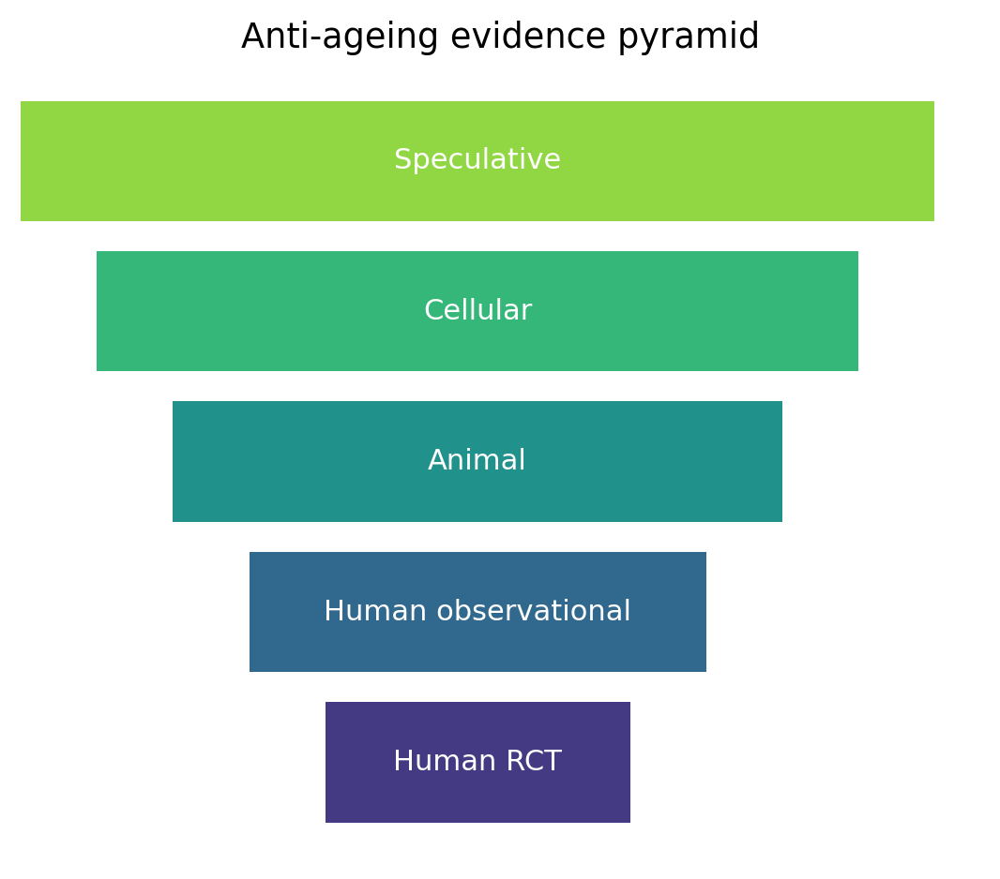
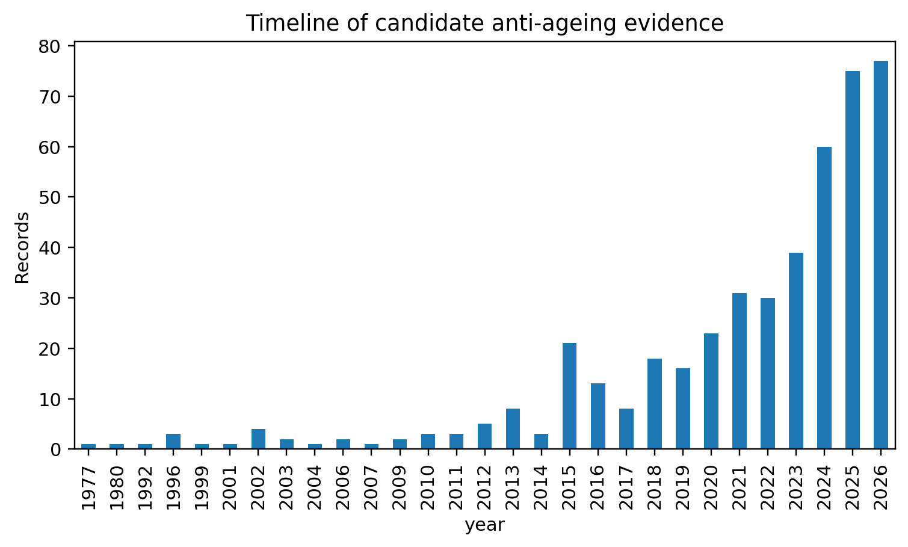
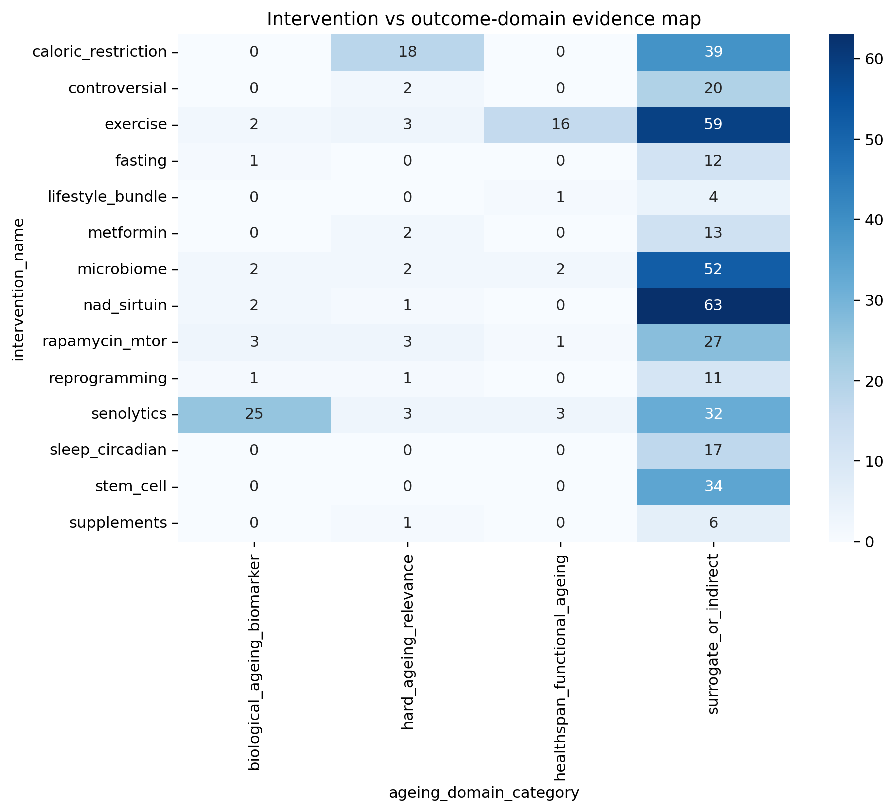
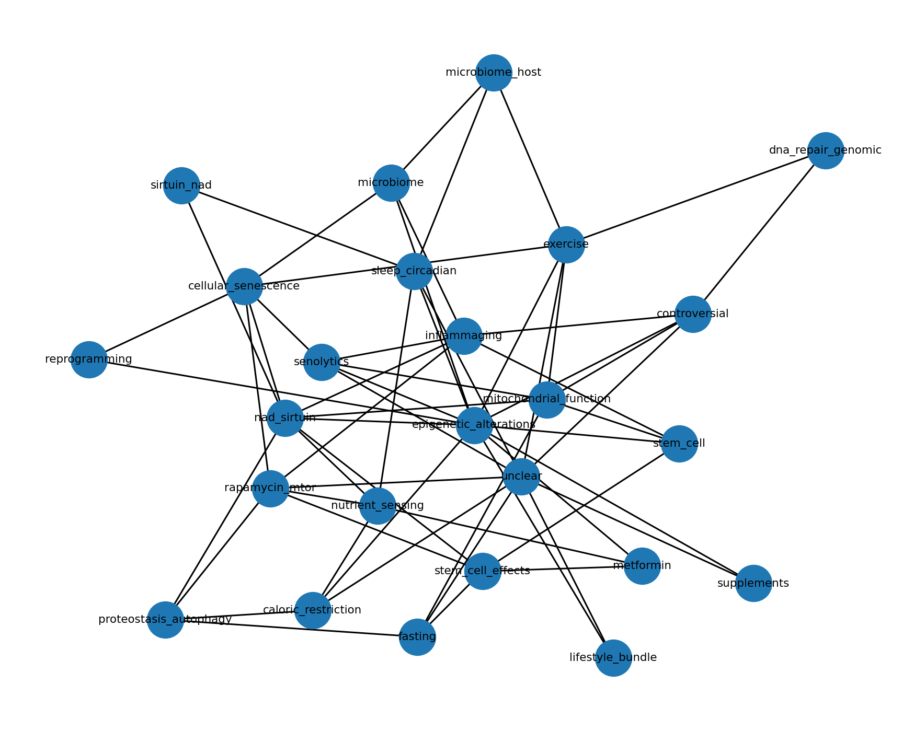

# Supplementary Material

# Can Ageing Be Slowed or Reversed? A Reproducible Evidence Map and Credibility Ranking of Anti-Ageing and Age-Reversal Interventions

Medical Journal of Dr. D.Y. Patil Vidyapeeth (MJDRDYPU)

Date: 2026-06-23 (Revision R1)

*This file contains 4 supplementary figures (S1--S4) and 9 supplementary
tables (S1--S9) that support the main manuscript. All items are derived
from the reproducible analysis described in the Methods.*

## Contents

**Supplementary Figures**

- Figure S1 -- Evidence pyramid (model-system distribution)

- Figure S2 -- Evidence timeline (record distribution by year and
  intervention)

- Figure S3 -- Intervention-outcome heatmap

- Figure S4 -- Mechanistic pathway network

**Supplementary Tables**

- Table S1 -- Additional records identified in search (refs 15--40)

- Table S2 -- Complete search strategy (all query strings and sources)

- Table S3 -- Full intervention credibility ranking (all 16 scored
  columns)

- Table S4 -- Translational readiness (all 10 columns, 14 intervention
  classes)

- Table S5 -- Full priority human verification results (40 records)

- Table S6 -- Full risk-of-bias appraisal (40 records)

- Table S7 -- Full effect-size extraction with candidate text (40
  records)

- Table S8 -- Duplicate cohort and overlapping-publication checks (45
  groups)

- Table S9 -- Quality control flags

# Supplementary Figures

{width="5.5in" height="4.839587707786527in"}

**Supplementary Figure S1. Evidence pyramid showing distribution of
candidate records by model system and evidence tier (n=1029 deduplicated
records). Human evidence forms the top tier; cellular and animal records
form the base. The pyramid illustrates why most extracted records cannot
be directly translated to human clinical recommendations without further
human-evidence confirmation.**

{width="6.0in" height="3.614314304461942in"}

**Supplementary Figure S2. Evidence timeline. Chronological distribution
of candidate anti-ageing records across intervention domains
(2010--2026). The chart shows the acceleration of records in exercise,
microbiome, senolytic, and NAD+/sirtuin domains in recent years.
Year-of-publication data are derived from extracted bibliographic
metadata; missing years reflect records with incomplete metadata.**

{width="6.0in" height="5.4448162729658796in"}

**Supplementary Figure S3. Intervention-outcome heatmap.
Metadata-assisted map of 14 intervention classes (rows) against
ageing-relevant outcome categories (columns). Cell intensity reflects
the count of candidate records in each intervention--outcome
combination. The map is a metadata-level overview presented to support
the main-text credibility ranking.**

{width="6.2in" height="4.962128171478565in"}

**Supplementary Figure S4. Mechanistic pathway network. Network showing
mapped links between intervention classes and candidate mechanistic
domains (nutrient sensing, senescence, inflammaging, epigenetic
regulation, mitochondrial function, autophagy/proteostasis, stem-cell
biology, microbiome-host pathways, and NAD+/sirtuin axis). Edge width
reflects the number of extracted records carrying the mapped mechanistic
label, derived from title/abstract metadata.**

# Supplementary Tables

*All tables are derived from the reproducible analysis described in the
Methods. Some column headers retain analysis field names where these are
self-explanatory. Two intervention-class labels in these tables denote
grouped search categories that are given self-explanatory names in the
main manuscript: "Supplements" (here) corresponds to "Dietary
supplements" (main text) and comprises resveratrol, curcumin, omega-3,
and vitamin D; "Controversial" (here) corresponds to "Plasma/telomerase"
(main text) and comprises blood- and plasma-based rejuvenation
(heterochronic parabiosis, young-plasma transfer, plasma dilution) and
telomerase activation. Full keyword groupings for every class are listed
in the search strategy (Supplementary Table S2).*

## Supplementary Table S1. Additional Records Identified in the Search (Refs 15--40)

*These 26 records were identified in the search (1029 deduplicated
records) and contributed to the overall evidence counts in the
credibility ranking. They are cited collectively as \[15--40\] in the
Methods section of the main manuscript.*

  ------------------------------------------------------------------------------------------------------------------------------------
  **Ref**   **First         **Year**   **Journal**    **Title (abbreviated)** **Intervention        **Identifier**
            author**                                                          class**               
  --------- --------------- ---------- -------------- ----------------------- --------------------- ----------------------------------
  15        Mihaiescu-Ion V 2026       BMC Geriatr    PRICA-POWFRAIL exercise exercise              doi:10.1186/s12877-025-06902-9
                                                      programme study                               
                                                      protocol                                      

  16        Robinson LA     2026       Front Nutr     Epigenetic and          microbiome            doi:10.3389/fnut.2026.1750030
                                                      microbiome responses to                       
                                                      greens supplementation                        

  17        Coleman AE      2025       GeroScience    TRIAD: rapamycin in     rapamycin_mtor        PMID:39951177
                                                      aging dogs (Dog Aging                         
                                                      Project)                                      

  18        Pihlstrom L     2024       J Neurol       NAD-HD: NR in           nad_sirtuin           doi:10.1136/jnnp-2024-ehdn.333
                                       Neurosurg      Huntington\'s disease                         
                                       Psychiatry     (NAD-HD trial)                                

  19        Nilsson MI      2024       Nutrients      Obesity/metabolic       exercise              PMID:39771028
                                                      disease impair anabolic                       
                                                      response to                                   
                                                      protein+exercise                              

  20        Erratum         2023       J Aging Phys   Erratum: Dancing +      exercise              doi:10.1123/japa.2023-0257
                                       Act            resistance training in                        
                                                      aging women                                   

  21        Yi L            2023       GeroScience    NMN supplementation in  nad_sirtuin           PMID:36482258
                                                      healthy middle-aged                           
                                                      adults: RCT                                   

  22        Waziry R        2023       Nat Aging      CALERIE trial: caloric  caloric_restriction   PMID:37118425
                                                      restriction and DNA                           
                                                      methylation aging                             

  23        Fiorito G       2021       Aging Cell     DAMA study:             lifestyle_bundle      PMID:34535961
                                                      diet+physical activity                        
                                                      and DNA methylation                           
                                                      aging                                         

  24        Stares A        2020       J Geriatr Phys Creatine + exercise in  exercise              PMID:30762623
                                       Ther           aging: systematic                             
                                                      review of RCTs                                

  25        Casas-Herrero A 2019       Trials         VIVIFRAIL               exercise              PMID:31208471
                                                      multicomponent exercise                       
                                                      in frail elders:                              
                                                      protocol                                      

  26        Vlietstra L     2025       Ageing Res Rev Exercise for frailty in exercise              doi:10.1016/j.arr.2025.102714
                                                      older adults with                             
                                                      hypertension: review                          

  27        Billot M        2020       Clin Interv    Physical activity       exercise              PMID:32982201
                                       Aging          recommendations for                           
                                                      frailty/sarcopenia                            

  28        Munoz-Pardeza J 2026       J Cachexia     Resistance training in  exercise              doi:10.1002/jcsm.70257
                                       Sarcopenia     youth with Type 1                             
                                       Muscle         Diabetes \[FLAG:                              
                                                      age/population\]                              

  29        Racette SB      2026       Am J Clin Nutr Diet quality in CALERIE caloric_restriction   doi:10.1016/j.ajcnut.2025.101182
                                                      2 calorie restriction                         
                                                      trial                                         

  30        Veronese N      2026       Aging Clin Exp European council        lifestyle_bundle      doi:10.1007/s40520-025-03315-x
                                       Res            recommendations: PA and                       
                                                      diet for mental health                        
                                                      in older adults                               

  31        Ying YY         2026       EBioMedicine   Circadian rhythm        nad_sirtuin           doi:10.1016/j.ebiom.2026.106200
                                                      disruption impairs                            
                                                      ovarian development via                       
                                                      NAD+ reprogramming                            

  32        Berven H        2026       iScience       NAD-brain               nad_sirtuin           doi:10.1016/j.isci.2026.114764
                                                      pharmacokinetic study                         
                                                      of oral NAD precursor                         
                                                      supplementation                               

  33        Kell L          2026       Aging Cell     Rapamycin               rapamycin_mtor        doi:10.1111/acel.70364
                                                      geroprotection in                             
                                                      ageing human immune                           
                                                      system via DNA damage                         
                                                      resilience                                    

  34        Bautista J      2026       Front          Biohacking the human    microbiome            doi:10.3389/fmicb.2026.1776983
                                       Microbiol      gut microbiome for                            
                                                      precision health                              

  35        Liu C           2026       Front Public   Research advances in    exercise              doi:10.3389/fpubh.2026.1763583
                                       Health         exercise management for                       
                                                      frail older adults                            

  36        Shi M           2026       Front Public   Editorial:              lifestyle_bundle      doi:10.3389/fpubh.2026.1777378
                                       Health         multidimensional                              
                                                      approaches to aging and                       
                                                      lifestyle interventions                       

  37        Saez-Nieto C    2026       Front Aging    Exercise training in    exercise              doi:10.3389/fragi.2026.1800669
                                                      frail older adults with                       
                                                      heart failure:                                
                                                      systematic review                             

  38        Lim MJS         2026       Nutrients      Diet, gut microbiome,   microbiome            doi:10.3390/nu18071052
                                                      and estrogen physiology                       
                                                      in menopausal health                          

  39        Poisnel G       2026       Alzheimers     Physical activity and   exercise              No DOI at extraction
                                       Dement (N Y)   Alzheimer\'s disease                          
                                                      biomarkers in older                           
                                                      adults                                        

  40        Gulej R         2025       Geroscience    Heterochronic           controversial         doi:10.1007/s11357-025-01657-y
                                                      parabiosis and plasma                         
                                                      transfer in                                   
                                                      cerebrovascular/brain                         
                                                      aging                                         
  ------------------------------------------------------------------------------------------------------------------------------------

*Note: Ref 28 (Munoz-Pardeza J, 2026) concerns youth with Type 1
Diabetes and is marginally relevant to anti-ageing in older adults. It
should be excluded or reclassified during final manual eligibility
adjudication.*

## Supplementary Table S2. Complete Search Strategy

*All 11 query strings were run across PubMed, Europe PMC, and Crossref
(retrieval limit: 35 records per query per source). Total records
retrieved: 11 queries × 3 databases × 35 records = 1155 raw records.*

  ---------------------------------------------------------------------------------------
  **\#**   **Source**   **Query string**                       **Records     **Status**
                                                               retrieved**   
  -------- ------------ -------------------------------------- ------------- ------------
  1        PubMed       (aging OR ageing OR longevity OR       35            ok
                        healthspan OR lifespan) AND                          
                        (intervention OR trial OR treatment OR               
                        therapy)                                             

           Europe PMC                                          35            ok

           Crossref                                            35            ok

  2        PubMed       (\"biological age\" OR \"epigenetic    35            ok
                        clock\" OR \"DNA methylation age\")                  
                        AND (intervention OR trial OR therapy)               

           Europe PMC                                          35            ok

           Crossref                                            35            ok

  3        PubMed       (rejuvenation OR \"age reversal\" OR   35            ok
                        \"reverse aging\" OR \"reverse                       
                        ageing\")                                            

           Europe PMC                                          35            ok

           Crossref                                            35            ok

  4        PubMed       (aging OR ageing OR healthspan OR      35            ok
                        lifespan) AND (\"caloric restriction\"               
                        OR \"dietary restriction\" OR fasting)               

           Europe PMC                                          35            ok

           Crossref                                            35            ok

  5        PubMed       (aging OR ageing OR healthspan OR      35            ok
                        frailty) AND (exercise OR \"physical                 
                        activity\" OR \"resistance training\")               

           Europe PMC                                          35            ok

           Crossref                                            35            ok

  6        PubMed       (aging OR ageing OR longevity OR       35            ok
                        frailty) AND (metformin OR rapamycin                 
                        OR sirolimus OR mTOR)                                

           Europe PMC                                          35            ok

           Crossref                                            35            ok

  7        PubMed       (aging OR ageing OR \"epigenetic       35            ok
                        clock\") AND (NAD OR \"nicotinamide                  
                        riboside\" OR NMN OR sirtuin)                        

           Europe PMC                                          35            ok

           Crossref                                            35            ok

  8        PubMed       (senescent cells OR senolytics OR      35            ok
                        senomorphics) AND (aging OR ageing OR                
                        rejuvenation)                                        

           Europe PMC                                          35            ok

           Crossref                                            35            ok

  9        PubMed       (stem cell OR reprogramming OR partial 35            ok
                        reprogramming) AND (aging OR                         
                        rejuvenation)                                        

           Europe PMC                                          35            ok

           Crossref                                            35            ok

  10       PubMed       (plasma OR parabiosis OR GDF11) AND    35            ok
                        (aging OR ageing OR rejuvenation)                    

           Europe PMC                                          35            ok

           Crossref                                            35            ok

  11       PubMed       (microbiome OR gut bacteria OR         35            ok
                        probiotics) AND (aging OR ageing OR                  
                        longevity)                                           

           Europe PMC                                          35            ok

           Crossref                                            35            ok
  ---------------------------------------------------------------------------------------

## Supplementary Table S3. Full Intervention Credibility Ranking (All Scored Columns)

*All 16 columns from the credibility ranking pipeline (n=14 intervention
classes). Credibility score combines human evidence, human trial
evidence, direct ageing/healthspan outcomes, biomarker evidence,
surrogate burden, and a promotional-language penalty.*

  ---------------------------------------------------------------------------------------------------------------------------------------------------------------------------------------------------
  **Rank**   **Intervention**   **Records\   **Human\   **Human\   **Hard    **Healthspan\   **Biomarker\   **Surrogate\   **Max\    **Mean\   **Hype\     **Hype\   **Credibility\   **Credibility
                                (n)**        rec**      trials**   ageing\   rec**           rec**          rec**          score**   score**   flagged**   rate**    score**          tier**
                                                                   rec**                                                                                                              
  ---------- ------------------ ------------ ---------- ---------- --------- --------------- -------------- -------------- --------- --------- ----------- --------- ---------------- ---------------
  1          Exercise           80           37         10         3         16              2              59             13.5      9.17      1           0.01      31.48            Highest
                                                                                                                                                                                      (healthspan
                                                                                                                                                                                      signal)

  2          Microbiome         58           8          2          2         2               2              52             12.0      6.37      3           0.05      21.50            Requires
                                                                                                                                                                                      verification

  3          Rapamycin/mTOR     34           7          3          3         1               3              27             11.0      7.01      1           0.03      21.24            Requires
                                                                                                                                                                                      verification

  4          Senolytics         63           7          1          3         3               25             32             10.0      7.10      5           0.08      19.94            Requires
                                                                                                                                                                                      verification

  5          Caloric            57           5          3          18        0               0              39             11.0      7.08      2           0.04      19.52            Requires
             restriction                                                                                                                                                              verification

  6          Lifestyle bundle   5            3          2          0         1               0              4              12.0      9.00      0           0.00      17.00            Requires
                                                                                                                                                                                      verification

  7          NAD+/sirtuin       66           8          2          1         0               2              63             9.5       6.22      2           0.03      16.64            Requires
                                                                                                                                                                                      verification

  8          Fasting            13           5          2          0         0               1              12             10.5      7.15      2           0.15      15.10            Requires
                                                                                                                                                                                      verification

  9          Supplements        7            6          0          1         0               0              6              9.0       7.79      0           0.00      13.70            Biomarker /
                                                                                                                                                                                      indirect

  10         Metformin          15           1          1          2         0               0              13             11.0      7.27      2           0.13      12.39            Biomarker /
                                                                                                                                                                                      indirect

  11         Sleep/circadian    17           1          1          0         0               0              17             11.0      6.65      0           0.00      10.45            Biomarker /
                                                                                                                                                                                      indirect

  12         Controversial      22           2          0          2         0               0              20             7.5       3.50      9           0.41      6.88             Biomarker /
                                                                                                                                                                                      indirect

  13         Reprogramming      13           0          0          1         0               1              11             8.0       4.23      10          0.77      5.91             Biomarker /
                                                                                                                                                                                      indirect

  14         Stem cell          34           0          0          0         0               0              34             5.5       4.53      14          0.41      1.68             Speculative /
                                                                                                                                                                                      low
  ---------------------------------------------------------------------------------------------------------------------------------------------------------------------------------------------------

## Supplementary Table S4. Translational Readiness (All Columns, n=14 Intervention Classes)

*Conservative category assignment using credibility score, human record
count, human trial count, direct ageing-outcome count, and
promotional-language burden.*

  --------------------------------------------------------------------------------------------------------------------------------------
  **Intervention**   **Credibility\   **Human\    **Human\   **Healthspan\   **Hard      **Biomarker\   **Hype\   **Translational
                     score**          records**   trials**   records**       ageing\     records**      rate**    category**
                                                                             records**                            
  ------------------ ---------------- ----------- ---------- --------------- ----------- -------------- --------- ----------------------
  Exercise           31.48            37          10         16              3           2              0.01      A -- Healthspan
                                                                                                                  support signal

  Microbiome         21.50            8           2          2               2           2              0.05      B -- Promising; not
                                                                                                                  recommendation-ready

  Rapamycin/mTOR     21.24            7           3          1               3           3              0.03      B -- Promising; not
                                                                                                                  recommendation-ready

  Senolytics         19.94            7           1          3               3           25             0.08      B -- Promising; not
                                                                                                                  recommendation-ready

  Caloric            19.52            5           3          0               18          0              0.04      B -- Promising; not
  restriction                                                                                                     recommendation-ready

  Lifestyle bundle   17.00            3           2          1               0           0              0.00      B -- Promising; not
                                                                                                                  recommendation-ready

  NAD+/sirtuin       16.64            8           2          0               1           2              0.03      B -- Promising; not
                                                                                                                  recommendation-ready

  Fasting            15.10            5           2          0               0           1              0.15      B -- Promising; not
                                                                                                                  recommendation-ready

  Supplements        13.70            6           0          0               1           0              0.00      C -- Biomarker /
                                                                                                                  indirect

  Metformin          12.39            1           1          0               2           0              0.13      C -- Biomarker /
                                                                                                                  indirect

  Sleep/circadian    10.45            1           1          0               0           0              0.00      C -- Biomarker /
                                                                                                                  indirect

  Controversial      6.88             2           0          0               2           0              0.41      C -- Biomarker /
                                                                                                                  indirect

  Reprogramming      5.91             0           0          0               1           1              0.77      C -- Biomarker /
                                                                                                                  indirect

  Stem cell          1.68             0           0          0               0           0              0.41      D -- Speculative / low
                                                                                                                  directness
  --------------------------------------------------------------------------------------------------------------------------------------

## Supplementary Table S5. Full Priority Human Verification Results (n=40 Records)

*All 40 records in the priority human verification pass. Source text
type: pmc_open_full_text = open full text retrieved from PubMed Central;
pubmed_abstract = PubMed abstract only; not_retrieved = unavailable in
the open workflow.*

  ----------------------------------------------------------------------------------------------------------------------------------------
  **Title                **PMID**     **PMCID**     **Source    **Verification   **Prov.         **Intervention\   **Ageing\   **Manual\
  (abbreviated)**                                   text type** status**         eligibility**   signal**          signal**    needed**
  ---------------------- ------------ ------------- ----------- ---------------- --------------- ----------------- ----------- -----------
  Baseline               41943481.0   PMC13053931   pmc open    open full text   eligible        True              True        True
  characteristics of the                            full text   verified         pending manual                                
  SINgapore GERiatric                                                            confirmation                                  
  Intervention Study...                                                                                                        

  Reducing frailty in    41984883.0   PMC13082602   pmc open    open full text   eligible        True              True        True
  frail people with                                 full text   verified         pending manual                                
  multiple sclerosis:                                                            confirmation                                  
  Feasibility ...                                                                                                              

  Effect of gut          38424099.0                 pubmed      abstract         eligible        True              True        True
  microbiome modulation                             abstract    verified full    pending manual                                
  on muscle function and                                        text pending     confirmation                                  
  cognition: ...                                                                                                               

  Assessing the Clinical 39024000.0                 pubmed      abstract         eligible        True              True        True
  Effectiveness of an                               abstract    verified full    pending manual                                
  Exergame-Based                                                text pending     confirmation                                  
  Exercise Tra...                                                                                                              

  Effects of Resistance                             not         not verified     uncertain or    True              False       True
  Exercise Training on                              retrieved   source           pending source                                
  Cognitive Function and                                        unavailable      review                                        
  Phys...                                                                                                                      

  Interaction between    41503609.0   PMC12771502   pmc open    open full text   eligible        True              True        True
  physical activity and                             full text   verified         pending manual                                
  deficit-based frailty                                                          confirmation                                  
  on all...                                                                                                                    

  Fasting-mimicking diet 38378685.0                 pubmed      abstract         eligible        True              True        True
  causes hepatic and                                abstract    verified full    pending manual                                
  blood markers changes                                         text pending     confirmation                                  
  indica...                                                                                                                    

  Topical rapamycin      31761958.0                 pubmed      abstract         eligible        True              True        True
  reduces markers of                                abstract    verified full    pending manual                                
  senescence and aging                                          text pending     confirmation                                  
  in human ski...                                                                                                              

  Influence of rapamycin 40188830.0                 pubmed      abstract         eligible        True              True        True
  on safety and                                     abstract    verified full    pending manual                                
  healthspan metrics                                            text pending     confirmation                                  
  after one year...                                                                                                            

  A Periodic Diet that   26094889.0                 pubmed      abstract         eligible        True              True        True
  Mimics Fasting                                    abstract    verified full    pending manual                                
  Promotes Multi-System                                         text pending     confirmation                                  
  Regeneration...                                                                                                              

  RESISTANCE TRAINING                               not         not verified     uncertain or    True              False       True
  AND CO-SUPPLEMENTATION                            retrieved   source           pending source                                
  WITH CREATINE AND                                             unavailable      review                                        
  PROTEIN I...                                                                                                                 

  Caloric restriction    41766355.0   PMC13049596   pmc open    open full text   eligible        True              True        True
  and time-restricted                               full text   verified         pending manual                                
  eating in older adults                                                         confirmation                                  
  with ov...                                                                                                                   

  A Multidomain          41677077.0   PMC12895478   pmc open    open full text   eligible        True              True        True
  Lifestyle Intervention                            full text   verified         pending manual                                
  Is Associated With                                                             confirmation                                  
  Improved Funct...                                                                                                            

  A phase II randomized  41835341.0   PMC12979913   pmc open    open full text   eligible        True              True        True
  placebo-controlled                                full text   verified         pending manual                                
  study of fisetin to                                                            confirmation                                  
  improve p...                                                                                                                 

  Viability of an        41663978.0   PMC12990574   pmc open    open full text   eligible        True              True        True
  educational program                               full text   verified         pending manual                                
  for lifestyle changes                                                          confirmation                                  
  and an algor...                                                                                                              

  Epigenetic and         41717034.0   PMC12915338   pmc open    open full text   eligible        True              True        True
  microbiome responses                              full text   verified         pending manual                                
  to greens                                                                      confirmation                                  
  supplementation in                                                                                                           
  obese...                                                                                                                     

  Test of Rapamycin in   39951177.0                 pubmed      abstract         eligible        True              True        True
  Aging Dogs (TRIAD):                               abstract    verified full    pending manual                                
  study design and                                              text pending     confirmation                                  
  rationale fo...                                                                                                              

  J012 NAD-HD: a                                    not         not verified     uncertain or    True              False       True
  randomized clinical                               retrieved   source           pending source                                
  trial of nicotinamide                                         unavailable      review                                        
  riboside in H...                                                                                                             

  Obesity and Metabolic  39771028.0                 pubmed      abstract         uncertain or    True              False       True
  Disease Impair the                                abstract    verified full    pending source                                
  Anabolic Response to                                          text pending     review                                        
  Protein ...                                                                                                                  

  Erratum. Effects of                               not         not verified     uncertain or    True              False       True
  Dancing Associated                                retrieved   source           pending source                                
  With Resistance                                               unavailable      review                                        
  Training on Fun...                                                                                                           

  The efficacy and       36482258.0                 pubmed      abstract         eligible        True              True        True
  safety of                                         abstract    verified full    pending manual                                
  β-nicotinamide                                                text pending     confirmation                                  
  mononucleotide (NMN)                                                                                                         
  supplem...                                                                                                                   

  Effect of long-term    37118425.0                 pubmed      abstract         eligible        True              True        True
  caloric restriction on                            abstract    verified full    pending manual                                
  DNA methylation                                               text pending     confirmation                                  
  measures of...                                                                                                               

  DNA methylation-based  34535961.0                 pubmed      abstract         eligible        True              True        True
  biomarkers of aging                               abstract    verified full    pending manual                                
  were slowed down in a                                         text pending     confirmation                                  
  two-ye...                                                                                                                    

  The Additive Effects   30762623.0                 pubmed      abstract         eligible        True              True        True
  of Creatine                                       abstract    verified full    pending manual                                
  Supplementation and                                           text pending     confirmation                                  
  Exercise Training...                                                                                                         

  Effect of a            31208471.0                 pubmed      abstract         eligible        True              True        True
  multicomponent                                    abstract    verified full    pending manual                                
  exercise programme                                            text pending     confirmation                                  
  (VIVIFRAIL) on                                                                                                               
  functiona...                                                                                                                 

  Exercise interventions                            not         not verified     uncertain or    True              False       True
  to improve physical                               retrieved   source           pending source                                
  frailty and physical                                          unavailable      review                                        
  frailt...                                                                                                                    

  Preserving Mobility in 32982201.0                 pubmed      abstract         eligible        True              True        True
  Older Adults with                                 abstract    verified full    pending manual                                
  Physical Frailty and                                          text pending     confirmation                                  
  Sarcopen...                                                                                                                  

  Effects of             41854192.0                 pubmed      abstract         uncertain or    True              False       True
  Diactive-1-Supported                              abstract    verified full    pending source                                
  Progressive Resistance                                        text pending     review                                        
  Training on Bod...                                                                                                           

  Diet quality and       41475553.0                 pubmed      abstract         eligible        True              True        True
  nutritional adequacy                              abstract    verified full    pending manual                                
  during a 2-year                                               text pending     confirmation                                  
  calorie restrict...                                                                                                          

  Recommendations from   41636947.0   PMC12917028   pmc open    open full text   eligible        True              True        True
  the European                                      full text   verified         pending manual                                
  interdisciplinary                                                              confirmation                                  
  council on ageing ...                                                                                                        

  Circadian rhythm       41797048.0   PMC12991957   pmc open    open full text   eligible        True              True        True
  disruption impairs                                full text   verified         pending manual                                
  ovarian follicular                                                             confirmation                                  
  development via...                                                                                                           

  The NAD-brain          41858901.0   PMC12996706   pmc open    open full text   eligible        True              True        True
  pharmacokinetic study                             full text   verified         pending manual                                
  of NAD augmentation in                                                         confirmation                                  
  blood and b...                                                                                                               

  Rapamycin Exerts Its   41524558.0   PMC12794675   pmc open    open full text   eligible        True              True        True
  Geroprotective Effects                            full text   verified         pending manual                                
  in the Ageing Human                                                            confirmation                                  
  Immune...                                                                                                                    

  Biohacking the human   41953448.0   PMC13055597   pmc open    open full text   eligible        True              True        True
  gut microbiome for                                full text   verified         pending manual                                
  precision health and                                                           confirmation                                  
  therapeut...                                                                                                                 

  Research advances in   41694501.0   PMC12894213   pmc open    open full text   eligible        True              True        True
  exercise management                               full text   verified         pending manual                                
  for frail older                                                                confirmation                                  
  adults.                                                                                                                      

  Editorial: Integrated  41635561.0   PMC12861890   pmc open    open full text   eligible        True              True        True
  strategies for                                    full text   verified         pending manual                                
  lifelong health:                                                               confirmation                                  
  multidimensional...                                                                                                          

  Effects of exercise    41969362.0   PMC13062297   pmc open    open full text   eligible        True              True        True
  training on frail                                 full text   verified         pending manual                                
  older adults with                                                              confirmation                                  
  heart failure:...                                                                                                            

  Diet, the Gut          41978103.0   PMC13074627   pmc open    open full text   eligible        True              True        True
  Microbiome, and                                   full text   verified         pending manual                                
  Estrogen Physiology: A                                                         confirmation                                  
  Review in Menopau...                                                                                                         

  Physical activity                   PMC13095858   pmc open    open full text   eligible        True              True        True
  attenuates the                                    full text   verified         pending manual                                
  association between                                                            confirmation                                  
  allostatic load a...                                                                                                         

  Impacts of systemic    40407975.0   PMC12635022   pmc open    open full text   eligible        True              True        True
  milieu on                                         full text   verified         pending manual                                
  cerebrovascular and                                                            confirmation                                  
  brain aging:                                                                                                                 
  insight...                                                                                                                   
  ----------------------------------------------------------------------------------------------------------------------------------------

## Supplementary Table S6. Full Risk-of-Bias Appraisal (n=40 Records)

*Structured risk-of-bias appraisal for all 40 priority human records,
following the signalling logic of RoB 2 (randomised trials) and
ROBINS-I (observational studies), based on available full-text or
abstract content.*

  -----------------------------------------------------------------------------------------------------------------------------------------
  **Title                **Randomisation**   **Blinding**   **Missing\   **Confounding**   **Outcome\      **Selective\   **Overall
  (abbreviated)**                                           data**                         measurement**   reporting**    (overall)**
  ---------------------- ------------------- -------------- ------------ ----------------- --------------- -------------- -----------------
  Baseline               Low                 Some concern   Unclear      Low (RCT)         Low--Some       Unclear (no    Some concern
  characteristics of the                                                                                   protocol)      
  SINgapore GERiatric                                                                                                     
  Intervention ...                                                                                                        

  Reducing frailty in    Low                 Low            Some concern Low (RCT)         Low--Some       Unclear (no    Low--Some
  frail people with                                                                                        protocol)      (pending)
  multiple sclerosis:                                                                                                     
  Feasibi...                                                                                                              

  Effect of gut          Low                 Low            Unclear      Low (RCT)         Low--Some       Unclear (no    Low--Some
  microbiome modulation                                                                                    protocol)      (pending)
  on muscle function and                                                                                                  
  cognit...                                                                                                               

  Assessing the Clinical Low                 Some concern   Unclear      Low (RCT)         Low--Some       Unclear (no    Some concern
  Effectiveness of an                                                                                      protocol)      
  Exergame-Based                                                                                                          
  Exercis...                                                                                                              

  Effects of Resistance  Some concern        Some concern   Unclear      Low (RCT)         Low--Some       Unclear (no    Some concern
  Exercise Training on                                                                                     protocol)      
  Cognitive Function                                                                                                      
  and...                                                                                                                  

  Interaction between    NA                  NA/unclear     Some concern Some              Low--Some       Unclear (no    Some concern
  physical activity and                                                  (observational)                   protocol)      
  deficit-based frailty                                                                                                   
  o...                                                                                                                    

  Fasting-mimicking diet Low                 Some concern   Unclear      Low (RCT)         Low--Some       Unclear (no    Some concern
  causes hepatic and                                                                                       protocol)      
  blood markers changes                                                                                                   
  i...                                                                                                                    

  Topical rapamycin      Some concern        Low            Some concern Low (RCT)         Low--Some       Unclear (no    Some concern
  reduces markers of                                                                                       protocol)      
  senescence and aging                                                                                                    
  in huma...                                                                                                              

  Influence of rapamycin Low                 Low            Unclear      Low (RCT)         Some concern    Unclear (no    Low--Some
  on safety and                                                                                            protocol)      (pending)
  healthspan metrics                                                                                                      
  after one...                                                                                                            

  A Periodic Diet that   Some concern        Some concern   Unclear      Low (RCT)         Some concern    Unclear (no    Some concern
  Mimics Fasting                                                                                           protocol)      
  Promotes Multi-System                                                                                                   
  Regener...                                                                                                              

  RESISTANCE TRAINING    Unclear/NA          Unclear/NA     Unclear      Serious/unclear   Low--Some       Unclear (no    Serious/unclear
  AND CO-SUPPLEMENTATION                                                                                   protocol)      
  WITH CREATINE AND                                                                                                       
  PROT...                                                                                                                 

  Caloric restriction    Low                 Low            Some concern Low (RCT)         Some concern    Unclear (no    Low--Some
  and time-restricted                                                                                      protocol)      (pending)
  eating in older adults                                                                                                  
  wi...                                                                                                                   

  A Multidomain          Low                 Low            Some concern Low (RCT)         Some concern    Unclear (no    Low--Some
  Lifestyle Intervention                                                                                   protocol)      (pending)
  Is Associated With                                                                                                      
  Improved ...                                                                                                            

  A phase II randomized  Low                 Low            Some concern Low (RCT)         Some concern    Unclear (no    Low--Some
  placebo-controlled                                                                                       protocol)      (pending)
  study of fisetin to                                                                                                     
  impr...                                                                                                                 

  Viability of an        Low                 Low            Some concern Low (RCT)         Some concern    Unclear (no    Low--Some
  educational program                                                                                      protocol)      (pending)
  for lifestyle changes                                                                                                   
  and an ...                                                                                                              

  Epigenetic and         Low                 Low            Unclear      Low (RCT)         Some concern    Unclear (no    Low--Some
  microbiome responses                                                                                     protocol)      (pending)
  to greens                                                                                                               
  supplementation in ...                                                                                                  

  Test of Rapamycin in   Low                 Low            Unclear      Low (RCT)         Some concern    Unclear (no    Low--Some
  Aging Dogs (TRIAD):                                                                                      protocol)      (pending)
  study design and                                                                                                        
  rationa...                                                                                                              

  J012 NAD-HD: a         Some concern        Some concern   Unclear      Low (RCT)         Some concern    Unclear (no    Some concern
  randomized clinical                                                                                      protocol)      
  trial of nicotinamide                                                                                                   
  riboside...                                                                                                             

  Obesity and Metabolic  Low                 Some concern   Unclear      Low (RCT)         Some concern    Unclear (no    Some concern
  Disease Impair the                                                                                       protocol)      
  Anabolic Response to                                                                                                    
  Pro...                                                                                                                  

  Erratum. Effects of    Some concern        Some concern   Unclear      Low (RCT)         Some concern    Unclear (no    Some concern
  Dancing Associated                                                                                       protocol)      
  With Resistance                                                                                                         
  Training o...                                                                                                           

  The efficacy and       Low                 Low            Unclear      Low (RCT)         Some concern    Unclear (no    Low--Some
  safety of                                                                                                protocol)      (pending)
  β-nicotinamide                                                                                                          
  mononucleotide (NMN)                                                                                                    
  su...                                                                                                                   

  Effect of long-term    Low                 Some concern   Unclear      Low (RCT)         Some concern    Unclear (no    Some concern
  caloric restriction on                                                                                   protocol)      
  DNA methylation                                                                                                         
  measur...                                                                                                               

  DNA methylation-based  Low                 Some concern   Unclear      Low (RCT)         Some concern    Unclear (no    Some concern
  biomarkers of aging                                                                                      protocol)      
  were slowed down in a                                                                                                   
  t...                                                                                                                    

  The Additive Effects   Low                 Some concern   Unclear      Low (RCT)         Some concern    Unclear (no    Some concern
  of Creatine                                                                                              protocol)      
  Supplementation and                                                                                                     
  Exercise Tra...                                                                                                         

  Effect of a            Low                 Some concern   Unclear      Low (RCT)         Some concern    Unclear (no    Some concern
  multicomponent                                                                                           protocol)      
  exercise programme                                                                                                      
  (VIVIFRAIL) on func...                                                                                                  

  Exercise interventions Unclear/NA          Unclear/NA     Unclear      Serious/unclear   Low--Some       Unclear (no    Serious/unclear
  to improve physical                                                                                      protocol)      
  frailty and physical                                                                                                    
  f...                                                                                                                    

  Preserving Mobility in Unclear/NA          Unclear/NA     Unclear      Serious/unclear   Low--Some       Unclear (no    Serious/unclear
  Older Adults with                                                                                        protocol)      
  Physical Frailty and                                                                                                    
  Sar...                                                                                                                  

  Effects of             Low                 Some concern   Unclear      Low (RCT)         Some concern    Unclear (no    Some concern
  Diactive-1-Supported                                                                                     protocol)      
  Progressive Resistance                                                                                                  
  Training o...                                                                                                           

  Diet quality and       Low                 Some concern   Unclear      Low (RCT)         Some concern    Unclear (no    Some concern
  nutritional adequacy                                                                                     protocol)      
  during a 2-year                                                                                                         
  calorie res...                                                                                                          

  Recommendations from   NA                  NA/unclear     Unclear      Some              Some concern    Unclear (no    Some concern
  the European                                                           (observational)                   protocol)      
  interdisciplinary                                                                                                       
  council on ag...                                                                                                        

  Circadian rhythm       Unclear/NA          Unclear/NA     Unclear      Serious/unclear   Some concern    Unclear (no    Serious/unclear
  disruption impairs                                                                                       protocol)      
  ovarian follicular                                                                                                      
  developmen...                                                                                                           

  The NAD-brain          NA                  NA/unclear     Unclear      Some              Some concern    Unclear (no    Some concern
  pharmacokinetic study                                                  (observational)                   protocol)      
  of NAD augmentation in                                                                                                  
  blood ...                                                                                                               

  Rapamycin Exerts Its   Unclear/NA          Unclear/NA     Unclear      Serious/unclear   Some concern    Unclear (no    Serious/unclear
  Geroprotective Effects                                                                                   protocol)      
  in the Ageing Human                                                                                                     
  I...                                                                                                                    

  Biohacking the human   NA                  NA/unclear     Unclear      Some              Some concern    Unclear (no    Some concern
  gut microbiome for                                                     (observational)                   protocol)      
  precision health and                                                                                                    
  ther...                                                                                                                 

  Research advances in   Unclear/NA          Unclear/NA     Unclear      Serious/unclear   Some concern    Unclear (no    Serious/unclear
  exercise management                                                                                      protocol)      
  for frail older                                                                                                         
  adults.                                                                                                                 

  Editorial: Integrated  NA                  NA/unclear     Unclear      Some              Some concern    Unclear (no    Some concern
  strategies for                                                         (observational)                   protocol)      
  lifelong health:                                                                                                        
  multidimens...                                                                                                          

  Effects of exercise    Unclear/NA          Unclear/NA     Unclear      Serious/unclear   Some concern    Unclear (no    Serious/unclear
  training on frail                                                                                        protocol)      
  older adults with                                                                                                       
  heart fai...                                                                                                            

  Diet, the Gut          NA                  NA/unclear     Unclear      Some              Some concern    Unclear (no    Some concern
  Microbiome, and                                                        (observational)                   protocol)      
  Estrogen Physiology: A                                                                                                  
  Review in Me...                                                                                                         

  Physical activity      NA                  NA/unclear     Some concern Some              Some concern    Unclear (no    Some concern
  attenuates the                                                         (observational)                   protocol)      
  association between                                                                                                     
  allostatic l...                                                                                                         

  Impacts of systemic    NA                  NA/unclear     Unclear      Some              Some concern    Unclear (no    Some concern
  milieu on                                                              (observational)                   protocol)      
  cerebrovascular and                                                                                                     
  brain aging: in...                                                                                                      
  -----------------------------------------------------------------------------------------------------------------------------------------

## Supplementary Table S7. Full Effect-Size Extraction with Candidate Text (n=40 Records)

*Candidate numeric effect text extracted from open full text or PubMed
abstracts for all 40 priority human records. The \'Candidate text\'
column shows the first extracted window (\~280 characters). Effect
estimates are not harmonised or pooled; manual verification is required
for all records before quantitative synthesis.*

  ------------------------------------------------------------------------------------------------------------------
  **Title                **Intervention**   **Outcome        **Extraction   **Candidate text (first       **Manual
  (abbreviated)**                           domain**         status**       window)**                     needed**
  ---------------------- ------------------ ---------------- -------------- ----------------------------- ----------
  Baseline               Lifestyle bundle   Healthspan /     candidate      tervention (606 each; three   True
  characteristics of the                    function         numeric effect exclusions per arm).          
  SINgapore GERiatric                                        text extracted Participants had a mean age   
  Int...                                                                    of 68.7 years and a mean of   
                                                                            12.5 years of education;      
                                                                            96.4% were Chinese. High      
                                                                            rates of                      

  Reducing frailty in    Exercise           Healthspan /     candidate      frail people with MS.         True
  frail people with                         function         numeric effect Materials and methods Sixteen 
  multiple sclerosi...                                       text extracted frail people with MS (age =   
                                                                            55.0 ± 7.7 years, 81.3%       
                                                                            female, Fried frailty score   
                                                                            ≥3) participated in this      
                                                                            pilot r                       

  Effect of gut          Microbiome         Healthspan /     candidate      rence between prebiotic and   True
  microbiome modulation                     function         numeric effect placebo for the primary       
  on muscle function ...                                     text extracted outcome of chair rise time (β 
                                                                            = 0.579; 95% CI -1.080-2.239  
                                                                            p = 0.494). The prebiotic     
                                                                            improves cognition (fact      

  Assessing the Clinical Exercise           Healthspan /     candidate      pare the training effects on  True
  Effectiveness of an                       function         numeric effect outcomes. We recruited 96     
  Exergame-Bas...                                            text extracted individuals, of whom 60 (62%) 
                                                                            underwent randomization. Of   
                                                                            these 60 participants, 55     
                                                                            (92%) completed the stud      

  Effects of Resistance  Exercise           Healthspan /     not extracted  Not extracted                 True
  Exercise Training on                      function         no source text                               
  Cognitive Fu...                                                                                         

  Interaction between    Exercise           Hard ageing      candidate      Health, Ageing and Retirement True
  physical activity and                     relevance        numeric effect in Europe (56,555             
  deficit-based...                                           text extracted participants, median          
                                                                            follow-up 6.5 years), China   
                                                                            Health and Retirement         
                                                                            Longitudinal Study (12,271    
                                                                            participants, 9.              

  Fasting-mimicking diet Fasting            Biological-age   candidate      ive of morbidity and          True
  causes hepatic and                        biomarker        numeric effect mortality, 3 FMD cycles were  
  blood markers...                                           text extracted associated with a decrease of 
                                                                            2.5 years in median           
                                                                            biological age, independent   
                                                                            of weight loss. Nearly        
                                                                            identical fi                  

  Topical rapamycin      Rapamycin/mTOR     Biological-age   candidate      the study, and nineteen       True
  reduces markers of                        biomarker        numeric effect discontinued or were lost to  
  senescence and agi...                                      text extracted follow-up. A significant (P = 
                                                                            0.008) reduction in p16 INK4A 
                                                                            protein levels and an         
                                                                            increase in collagen VII      
                                                                            protein                       

  Influence of rapamycin Rapamycin/mTOR     Surrogate /      candidate      lar across all groups.        True
  on safety and                             indirect         numeric effect Visceral adiposity did not    
  healthspan metrics...                                      text extracted change significantly (η p 2 = 
                                                                            0.001, p = 0.942), and        
                                                                            changes in blood biomarkers   
                                                                            remained within normal        
                                                                            ranges. Lea                   

  A Periodic Diet that   Fasting            Surrogate /      no candidate   Not extracted                 True
  Mimics Fasting                            indirect         effect text                                  
  Promotes Multi-Syst...                                     found                                        

  RESISTANCE TRAINING    Exercise           Healthspan /     not extracted  Not extracted                 True
  AND CO-SUPPLEMENTATION                    function         no source text                               
  WITH CREATIN...                                                                                         

  Caloric restriction    Caloric            Surrogate /      candidate      s\) adults with obesity or    True
  and time-restricted    restriction        indirect         numeric effect overweight to one of three    
  eating in older...                                         text extracted 9-month interventions: (1)    
                                                                            20% CR delivered in-person;   
                                                                            (2) 20% CR delivered remotely 
                                                                            (RCR); and (3) 8-hour TRE     

  A Multidomain          Lifestyle bundle   Surrogate /      candidate      2, we recruited 47 frail,     True
  Lifestyle Intervention                    indirect         numeric effect community‐dwelling            
  Is Associated With...                                      text extracted individuals in Spain. Mean    
                                                                            age was 80.2 years (SD 3.1)   
                                                                            in the control group (CG; n = 
                                                                            19) and 80.5 years (4.3) in   
                                                                            the in                        

  A phase II randomized  Senolytics         Surrogate /      candidate      e blood cell count \> 2000/mm True
  placebo-controlled                        indirect         numeric effect 3 Absolute neutrophil count   
  study of fiset...                                          text extracted \> 500/mm 3 Hemoglobin ⩾8.0   
                                                                            g/dL Total bilirubin ⩽ 3.0 X  
                                                                            ULN AST ⩽ 4.0 × ULN ALT ⩽ 4.0 
                                                                            × ULN eGFR of ⩾ 30 m          

  Viability of an        Exercise           Surrogate /      candidate      ary Information The online    True
  educational program                       indirect         numeric effect version contains              
  for lifestyle chang...                                     text extracted supplementary material        
                                                                            available at                  
                                                                            10.1186/s12877-025-06902-9.   
                                                                            Background In the last        
                                                                            decades we are witnessing the 
                                                                            demogr                        

  Epigenetic and         Microbiome         Surrogate /      candidate      xiety, and Stress Scale       True
  microbiome responses                      indirect         numeric effect (DASS-21)\]. Twenty-one       
  to greens supplemen...                                     text extracted participants began the        
                                                                            protocol (65% female, mean    
                                                                            age 58.4 ± 5.3 years, mean    
                                                                            BMI 38.1 ± 8 kg/m 2 ).        
                                                                            Nineteen partici              

  Test of Rapamycin in   Rapamycin/mTOR     Surrogate /      no candidate   Not extracted                 True
  Aging Dogs (TRIAD):                       indirect         effect text                                  
  study design a...                                          found                                        

  J012 NAD-HD: a         NAD+/sirtuin       Surrogate /      not extracted  Not extracted                 True
  randomized clinical                       indirect         no source text                               
  trial of                                                                                                
  nicotinamid...                                                                                          

  Obesity and Metabolic  Exercise           Surrogate /      candidate      tely strong, negative         True
  Disease Impair the                        indirect         numeric effect correlations to the adaptive  
  Anabolic Respo...                                          text extracted response to polytherapy r =   
                                                                            -0.36 to -0.68 ( p \< 0.05).  
                                                                            Kidney function, PA level,    
                                                                            and chronological age were    
                                                                            onl                           

  Erratum. Effects of    Exercise           Surrogate /      not extracted  Not extracted                 True
  Dancing Associated                        indirect         no source text                               
  With Resistance ...                                                                                     

  The efficacy and       NAD+/sirtuin       Surrogate /      candidate      In animal studies,            True
  safety of                                 indirect         numeric effect β-nicotinamide mononucleotide 
  β-nicotinamide                                             text extracted (NMN) supplementation         
  mononucleotid...                                                          increases nicotinamide adenin 

  Effect of long-term    Caloric            Surrogate /      candidate      zed controlled trial in which True
  caloric restriction on restriction        indirect         numeric effect n = 220 adults without        
  DNA methylat...                                            text extracted obesity were randomized to    
                                                                            25% CR or ad libitum control  
                                                                            diet for 2 yr (ref. 10 ). We  
                                                                            found that CALERIE interv     

  DNA methylation-based  Exercise           Surrogate /      no candidate   Not extracted                 True
  biomarkers of aging                       indirect         effect text                                  
  were slowed d...                                           found                                        

  The Additive Effects   Exercise           Surrogate /      no candidate   Not extracted                 True
  of Creatine                               indirect         effect text                                  
  Supplementation and                                        found                                        
  Ex...                                                                                                   

  Effect of a            Exercise           Surrogate /      no candidate   Not extracted                 True
  multicomponent                            indirect         effect text                                  
  exercise programme                                         found                                        
  (VIVIFRAI...                                                                                            

  Exercise interventions Exercise           Healthspan /     not extracted  Not extracted                 True
  to improve physical                       function         no source text                               
  frailty and ...                                                                                         

  Preserving Mobility in Exercise           Healthspan /     no candidate   Not extracted                 True
  Older Adults with                         function         effect text                                  
  Physical Frail...                                          found                                        

  Effects of             Exercise           Surrogate /      candidate      e 1 diabetes. Sixty-two       True
  Diactive-1-Supported                      indirect         numeric effect participants with type 1      
  Progressive Resistance                                     text extracted diabetes (aged 8-18 years     
  ...                                                                       old; 48% females)             
                                                                            participated in a 24-week     
                                                                            randomised controlled trial   
                                                                            and were assigne              

  Diet quality and       Caloric            Surrogate /      candidate      . CALERIE 2 was a multisite   True
  nutritional adequacy   restriction        indirect         numeric effect trial of healthy adults       
  during a 2-year c...                                       text extracted randomly assigned to 2 y of   
                                                                            25% CR or an ad libitum (AL)  
                                                                            control condition. CR         
                                                                            participants received         
                                                                            extensive                     

  Recommendations from   Exercise           Surrogate /      candidate      lation is accelerating, with  True
  the European                              indirect         numeric effect projections indicating that   
  interdisciplinary                                          text extracted by 2050, there will be 1.5    
  cou...                                                                    billion people aged 65 years  
                                                                            and over. This demographic    
                                                                            shift is accompanied by       

  Circadian rhythm       Sleep/circadian    Surrogate /      candidate      ameliorate mitochondria       True
  disruption impairs                        indirect         numeric effect function and increase the     
  ovarian follicular ...                                     text extracted numbers of antral follicles   
                                                                            (49.56 ± 0.55 vs. 21.83 ±     
                                                                            1.35, p = 0.001) and          
                                                                            retrieved oocytes (18.40 ±    
                                                                            1.91 vs. 3.8                  

  The NAD-brain          NAD+/sirtuin       Surrogate /      candidate      Demographic All ( n = 6)      True
  pharmacokinetic study                     indirect         numeric effect Female ( n = 3) Male ( n = 3) 
  of NAD augmentation...                                     text extracted p -value a Age in years 45.00 
                                                                            ± 1.67 Range 43--47 45.33 ±   
                                                                            2.08 44.66 ± 1.52 0.67 BMI in 
                                                                            kg/m 2 24.31 ± 2.08 24        

  Rapamycin Exerts Its   Rapamycin/mTOR     Surrogate /      candidate      ing cancer therapy and        True
  Geroprotective Effects                    indirect         numeric effect safeguarding astronauts from  
  in the Agei...                                             text extracted cosmic radiation. 2 Results   
                                                                            2.1 DNA Damage in T Cells Is  
                                                                            Associated With Elevated      
                                                                            mTORC Signalling In order to  

  Biohacking the human   Microbiome         Surrogate /      candidate      ions, reporting significant   True
  gut microbiome for                        indirect         numeric effect reductions in depression and  
  precision healt...                                         text extracted anxiety symptoms, with        
                                                                            standardized mean differences 
                                                                            from −0.26 to −1.76 across    
                                                                            populations. Variations in    
                                                                            therapeutic response ref      

  Research advances in   Exercise           Surrogate /      candidate      railty is on the rise.        True
  exercise management                       indirect         numeric effect Studies show that in some     
  for frail olde...                                          text extracted populations, approximately    
                                                                            16. 1% of the older adults    
                                                                            can be classified as frailty, 
                                                                            while 58. 1% of the older adu 

  Editorial: Integrated  Lifestyle bundle   Surrogate /      no candidate   Not extracted                 True
  strategies for                            indirect         effect text                                  
  lifelong health: m...                                      found                                        

  Effects of exercise    Exercise           Surrogate /      candidate      ntrolled trials with sample   True
  training on frail                         indirect         numeric effect sizes ranging from 30 to 337  
  older adults with...                                       text extracted participants (mean age 72.5   
                                                                            years). Frailty was assessed  
                                                                            using the Frailty Phenotype,  
                                                                            Frailty Index, and Sh         

  Diet, the Gut          Microbiome         Surrogate /      candidate      y in proactive management     True
  Microbiome, and                           indirect         numeric effect during the perimenopausal     
  Estrogen Physiology: A                                     text extracted transition. 1. Introduction   
  Re...                                                                     1.1. Overview of Menopause    
                                                                            Menopause, defined as the     
                                                                            absence of menses for twelve  
                                                                            c                             

  Physical activity      Exercise           Surrogate /      candidate      lar‐respiratory, and          True
  attenuates the                            indirect         numeric effect anthropometric systems.       
  association between                                        text extracted Plasma biomarkers included    
  al...                                                                     amyloid beta (Aβ)42, Aβ40,    
                                                                            phosphorylated‐tau            
                                                                            (p‐tau231), glial fibrillary  
                                                                            acidic protein (G             

  Impacts of systemic    Controversial      Surrogate /      candidate      0, reaching 152 million \[ 6  True
  milieu on                                 indirect         numeric effect -- 8 \]. For example, in the  
  cerebrovascular and                                        text extracted USA alone, approximately 6.2  
  brain...                                                                  million individuals are       
                                                                            affected by dementia, while   
                                                                            in Europe, around 10.5 mill   
  ------------------------------------------------------------------------------------------------------------------

## Supplementary Table S8. Duplicate Cohort and Overlapping-Publication Checks (n=45 Groups)

*Duplicate and overlapping-cohort check results using DOI, PMID,
normalised title, and trial acronym keys. All flagged groups require
manual adjudication before final evidence counts are published. These
flags do not constitute final duplicate removal decisions.*

  -----------------------------------------------------------------------------------
  **Check type**   **Duplicate key**               **N         **Manual action**
                                                   records**   
  ---------------- ------------------------------- ----------- ----------------------
  pmid             40700575.0                      2           review for duplicate
                                                               publication or
                                                               overlapping cohort

  pmid             40816266.0                      2           review for duplicate
                                                               publication or
                                                               overlapping cohort

  pmid             41792328.0                      2           review for duplicate
                                                               publication or
                                                               overlapping cohort

  title_norm       a critical assessment of        2           review for duplicate
                   fasting to promote metabolic                publication or
                   health and longevity                        overlapping cohort

  title_norm       decision letter for survey on   2           review for duplicate
                   fecal microbiota                            publication or
                   transplantation and probiotic               overlapping cohort
                   use in e...                                 

  title_norm       design and synthesis of         2           review for duplicate
                   senescence targeted prodrugs                publication or
                   with senomorphic and senolytic              overlapping cohort
                   p...                                        

  title_norm       dietary restriction in aging    2           review for duplicate
                   and longevity                               publication or
                                                               overlapping cohort

  title_norm       exploring senolytic and         2           review for duplicate
                   senomorphic properties of                   publication or
                   medicinal plants for anti aging             overlapping cohort
                   the...                                      

  title_norm       exploring the effects of        2           review for duplicate
                   dasatinib quercetin and fisetin             publication or
                   on dna methylation clocks a ...             overlapping cohort

  title_norm       fasting or caloric restriction  2           review for duplicate
                   for healthy aging                           publication or
                                                               overlapping cohort

  title_norm       heterogeneity of cellular       2           review for duplicate
                   senescence senotyping and                   publication or
                   targeting by senolytics and                 overlapping cohort
                   senom...                                    

  title_norm       mechanistic links between the   2           review for duplicate
                   gut microbiome and longevity                publication or
                   therapeutics                                overlapping cohort

  title_norm       metformin for longevity and     2           review for duplicate
                   sarcopenia a therapeutic                    publication or
                   paradox in aging                            overlapping cohort

  title_norm       nicotinamide riboside chloride  2           review for duplicate
                                                               publication or
                                                               overlapping cohort

  title_norm       peer review report for dietary  3           review for duplicate
                   restriction with and without                publication or
                   caloric restriction for h...                overlapping cohort

  title_norm       prevalent mesenchymal drift in  2           review for duplicate
                   aging and disease is reversed               publication or
                   by partial reprogramming                    overlapping cohort

  title_norm       rapamycin for longevity opinion 2           review for duplicate
                   article                                     publication or
                                                               overlapping cohort

  title_norm       review for caloric restriction  6           review for duplicate
                   extends lifespan in a clonal                publication or
                   plant                                       overlapping cohort

  title_norm       review for survey on fecal      3           review for duplicate
                   microbiota transplantation and              publication or
                   probiotic use in equine pra...              overlapping cohort

  title_norm       senolytic drugs dasatinib and   2           review for duplicate
                   quercetin attenuate adipose                 publication or
                   tissue inflammation and ame...              overlapping cohort

  title_norm       towards personalized            2           review for duplicate
                   nicotinamide mononucleotide nmn             publication or
                   supplementation nicotinamide                overlapping cohort
                   ade...                                      

  trial_acronyms   DNA                             6           review for duplicate
                                                               publication or
                                                               overlapping cohort

  trial_acronyms   DNA; WLMT                       2           review for duplicate
                                                               publication or
                                                               overlapping cohort

  trial_acronyms   NAD                             34          review for duplicate
                                                               publication or
                                                               overlapping cohort

  trial_acronyms   NAD; NMN                        10          review for duplicate
                                                               publication or
                                                               overlapping cohort

  trial_acronyms   NMN                             3           review for duplicate
                                                               publication or
                                                               overlapping cohort

  trial_acronyms   SASP                            2           review for duplicate
                                                               publication or
                                                               overlapping cohort

  cohort_key       a critical assessment of        2           review for duplicate
                   fasting to promote metabolic                publication or
                   health and longevity                        overlapping cohort

  cohort_key       decision letter for survey on   2           review for duplicate
                   fecal microbiota                            publication or
                   transplantation and probiotic               overlapping cohort
                   use in e...                                 

  cohort_key       design and synthesis of         2           review for duplicate
                   senescence targeted prodrugs                publication or
                   with senomorphic and senolytic              overlapping cohort
                   p...                                        

  cohort_key       dietary restriction in aging    2           review for duplicate
                   and longevity                               publication or
                                                               overlapping cohort

  cohort_key       exploring senolytic and         2           review for duplicate
                   senomorphic properties of                   publication or
                   medicinal plants for anti aging             overlapping cohort
                   the...                                      

  cohort_key       exploring the effects of        2           review for duplicate
                   dasatinib quercetin and fisetin             publication or
                   on dna methylation clocks a ...             overlapping cohort

  cohort_key       fasting or caloric restriction  2           review for duplicate
                   for healthy aging                           publication or
                                                               overlapping cohort

  cohort_key       heterogeneity of cellular       2           review for duplicate
                   senescence senotyping and                   publication or
                   targeting by senolytics and                 overlapping cohort
                   senom...                                    

  cohort_key       mechanistic links between the   2           review for duplicate
                   gut microbiome and longevity                publication or
                   therapeutics                                overlapping cohort

  cohort_key       metformin for longevity and     2           review for duplicate
                   sarcopenia a therapeutic                    publication or
                   paradox in aging                            overlapping cohort

  cohort_key       nicotinamide riboside chloride  2           review for duplicate
                                                               publication or
                                                               overlapping cohort

  cohort_key       peer review report for dietary  3           review for duplicate
                   restriction with and without                publication or
                   caloric restriction for h...                overlapping cohort

  cohort_key       prevalent mesenchymal drift in  2           review for duplicate
                   aging and disease is reversed               publication or
                   by partial reprogramming                    overlapping cohort

  cohort_key       rapamycin for longevity opinion 2           review for duplicate
                   article                                     publication or
                                                               overlapping cohort

  cohort_key       review for caloric restriction  6           review for duplicate
                   extends lifespan in a clonal                publication or
                   plant                                       overlapping cohort

  cohort_key       review for survey on fecal      3           review for duplicate
                   microbiota transplantation and              publication or
                   probiotic use in equine pra...              overlapping cohort

  cohort_key       senolytic drugs dasatinib and   2           review for duplicate
                   quercetin attenuate adipose                 publication or
                   tissue inflammation and ame...              overlapping cohort

  cohort_key       towards personalized            2           review for duplicate
                   nicotinamide mononucleotide nmn             publication or
                   supplementation nicotinamide                overlapping cohort
                   ade...                                      
  -----------------------------------------------------------------------------------

## Supplementary Table S9. Quality Control Flags

*Automated quality control checks run at the end of the pipeline. Flags
with severity \'high\' or \'medium\' must be resolved before the
manuscript is submitted as a completed systematic review.*

  ----------------------------------------------------------------------------------
  **Issue type**    **N         **Severity**   **Detail**
                    records**                  
  ----------------- ----------- -------------- -------------------------------------
  extraction schema 0           none           All required extraction fields
  missing fields                               present.

  unresolved        84          medium         Potential duplicate title/identifier
  duplicate groups                             groups require manual review before
                                               submission.

  preprint treated  0           none           Preprints should not be treated as
  as supported                                 established evidence.

  animal or         0           none           Animal/cellular records should not be
  cellular claim                               described as human-ready evidence.
  supported                                    

  surrogate         79          medium         Surrogate-only records should not
  endpoint                                     drive strong anti-ageing conclusions.
  overclassified                               

  metadata only     484         medium         These records require full-text
  claims                                       verification before final inference.

  missing effect    484         high           Comparable effect sizes are required
  sizes                                        before meta-analysis.

  intervention      0           none           No intervention should be marked
  supported without                            supported for healthspan without
  human records                                human records.

  speculative       0           none           Speculative classes with high scores
  intervention high                            need manual review of scoring
  score                                        components.
  ----------------------------------------------------------------------------------
