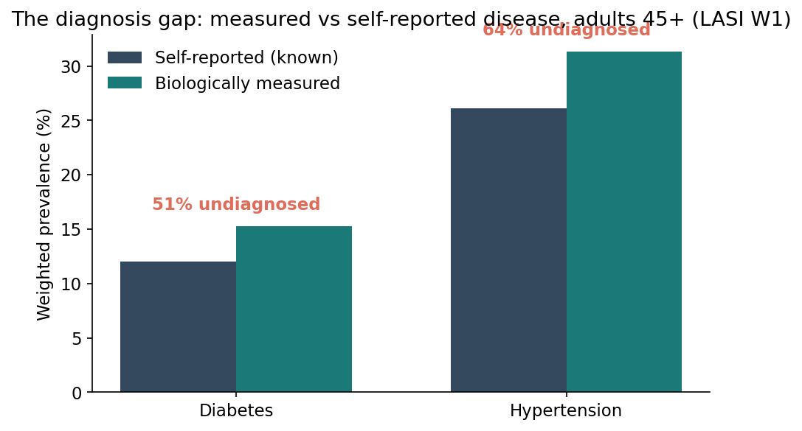
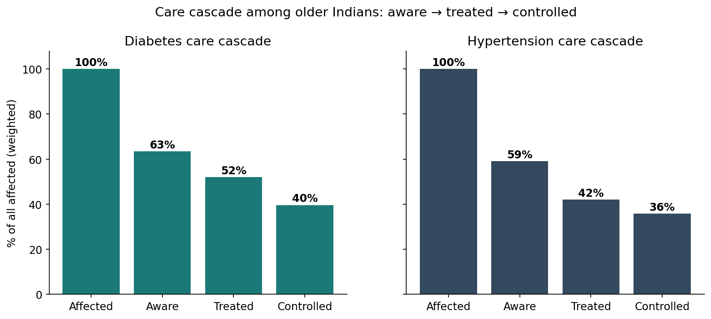
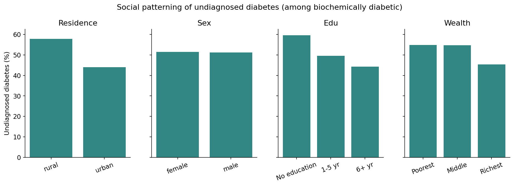
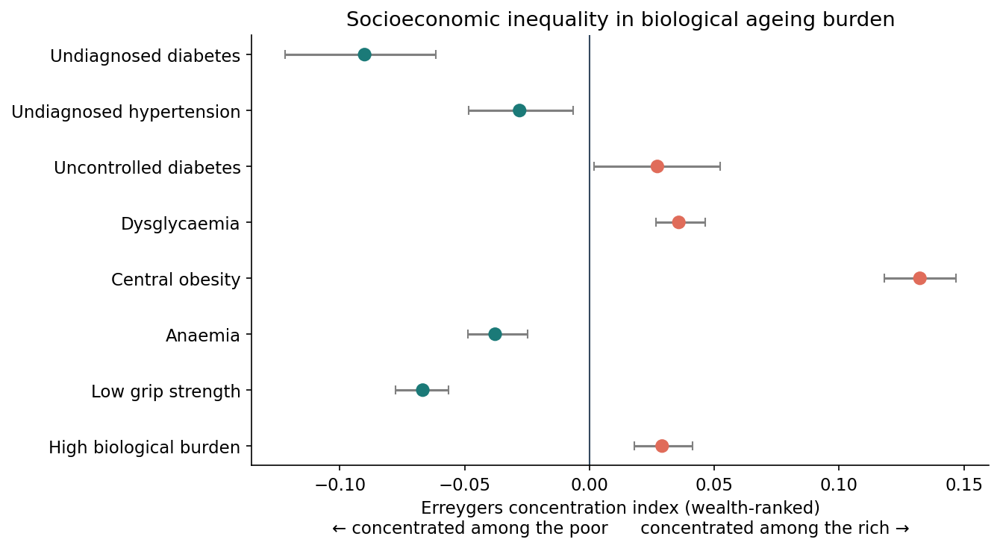
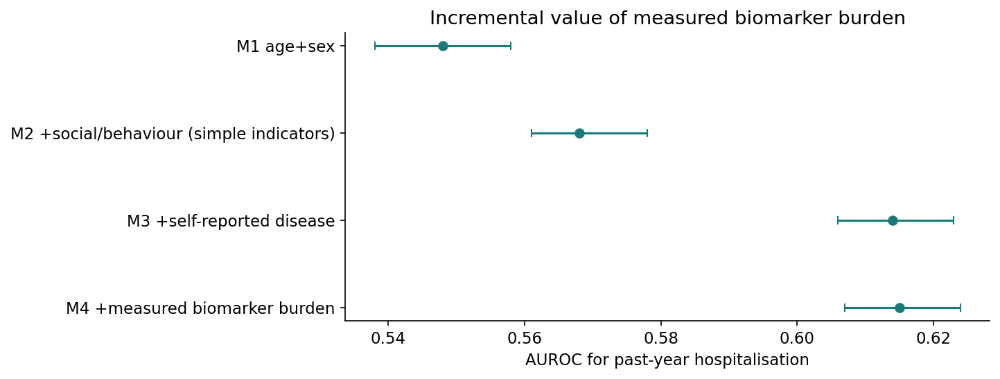
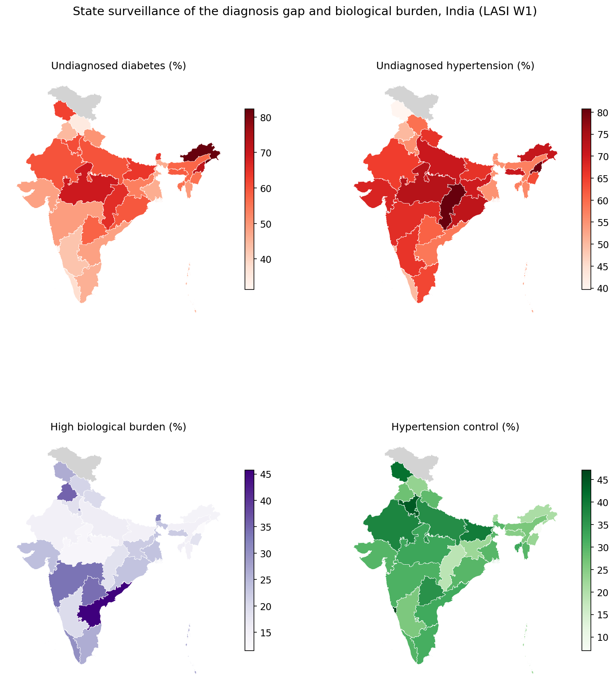
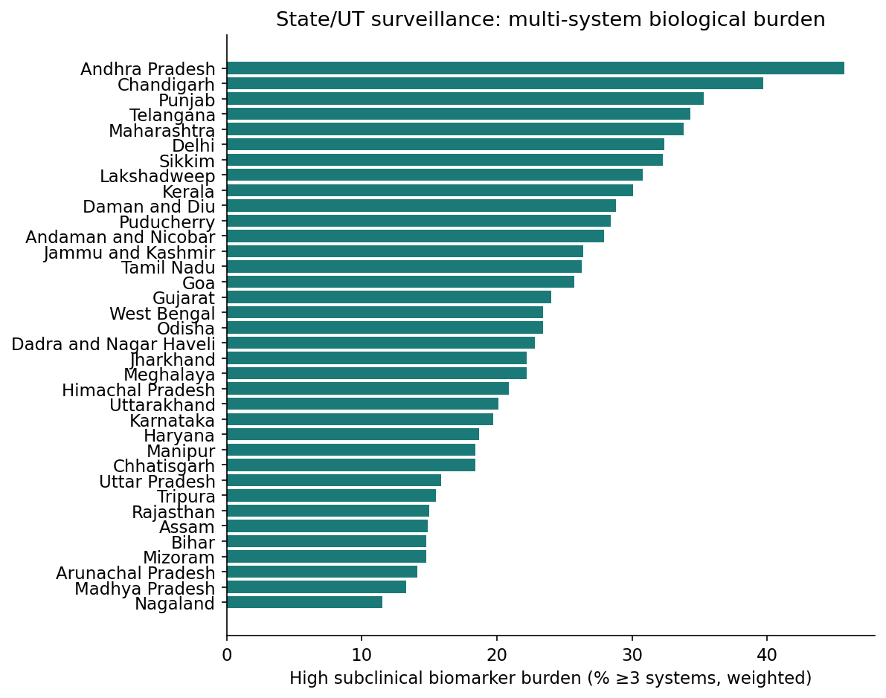
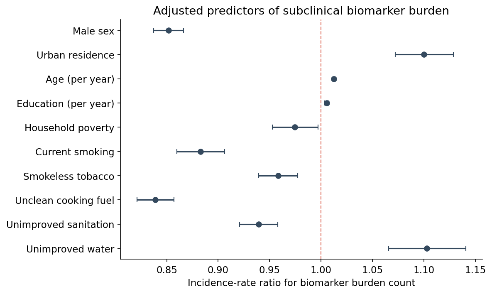

# Figures

**Figure 1.** The diagnosis gap: weighted prevalence of biologically measured versus self-reported diabetes and hypertension (adults 45+, LASI Wave 1). Annotations show the undiagnosed percentage among the biologically affected.

**Figure 2.** Care cascade among all affected older Indians (aware → treated → controlled) for diabetes and hypertension.

**Figure 3.** Social patterning of undiagnosed diabetes (among the biochemically diabetic) by residence, sex, education and household wealth.

**Figure 4.** Socioeconomic inequality in biological ageing burden: Erreygers concentration indices (wealth-ranked). Teal = concentrated among the poor; coral = concentrated among the rich.

**Figure 5.** Incremental value of measured biomarker burden for predicting past-year hospitalisation: AUROC (95% CI) across nested models.

**Figure 6.** State/union-territory surveillance maps: undiagnosed diabetes, undiagnosed hypertension, high multi-system biological burden, and hypertension control (weighted).

---

**Supplementary Figure S1.** State ranking by high biological burden (% ≥3 abnormal systems).

**Supplementary Figure S2.** Adjusted predictors (incidence-rate ratios) of the subclinical biomarker burden count. The count conflates opposing phenotypes; domain-specific associations (Supplementary Table S7) are the primary exposome analysis.

