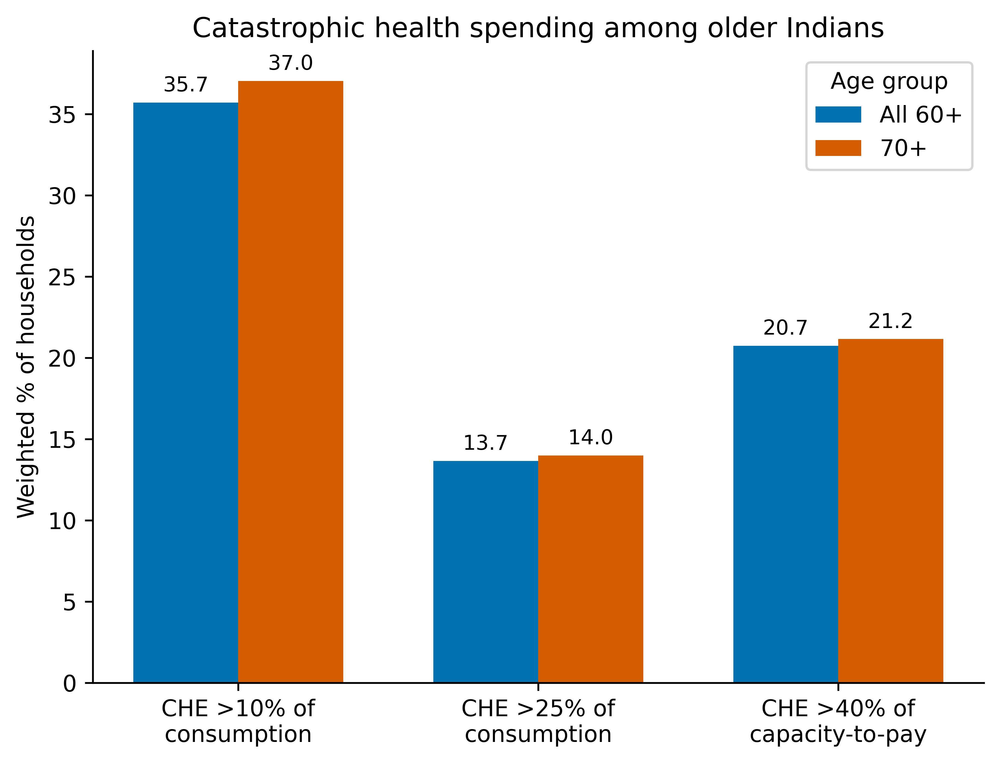
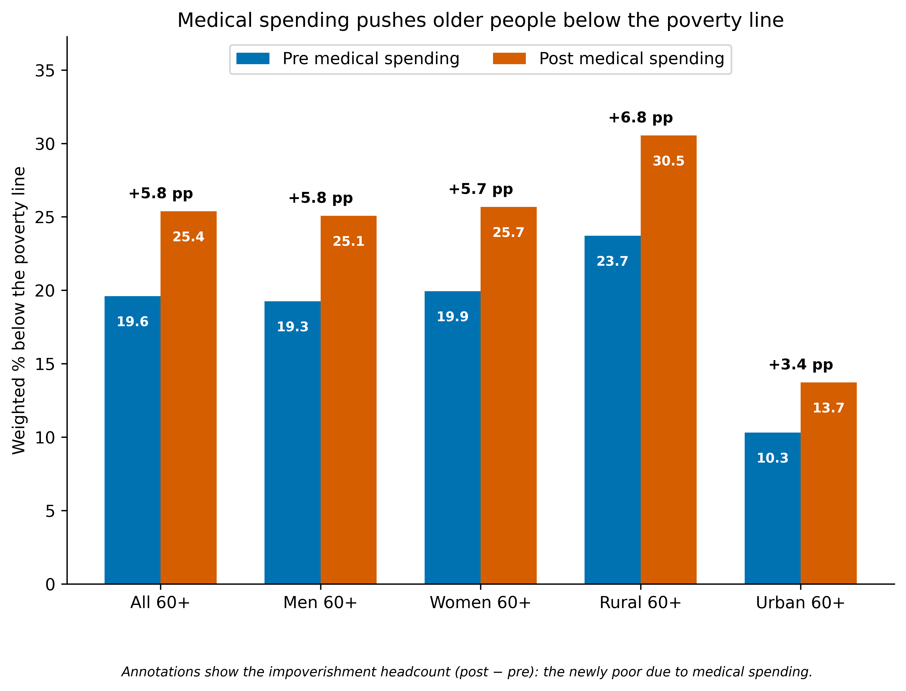
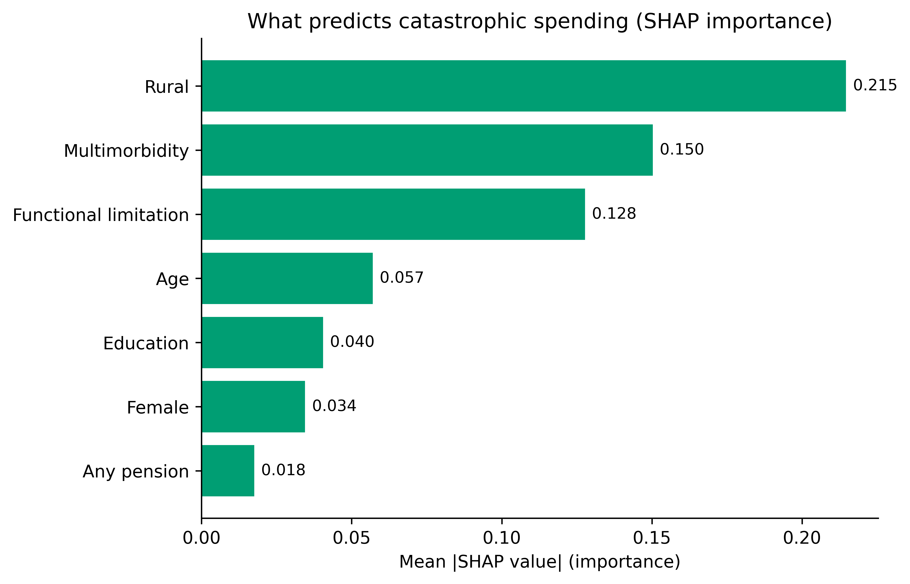
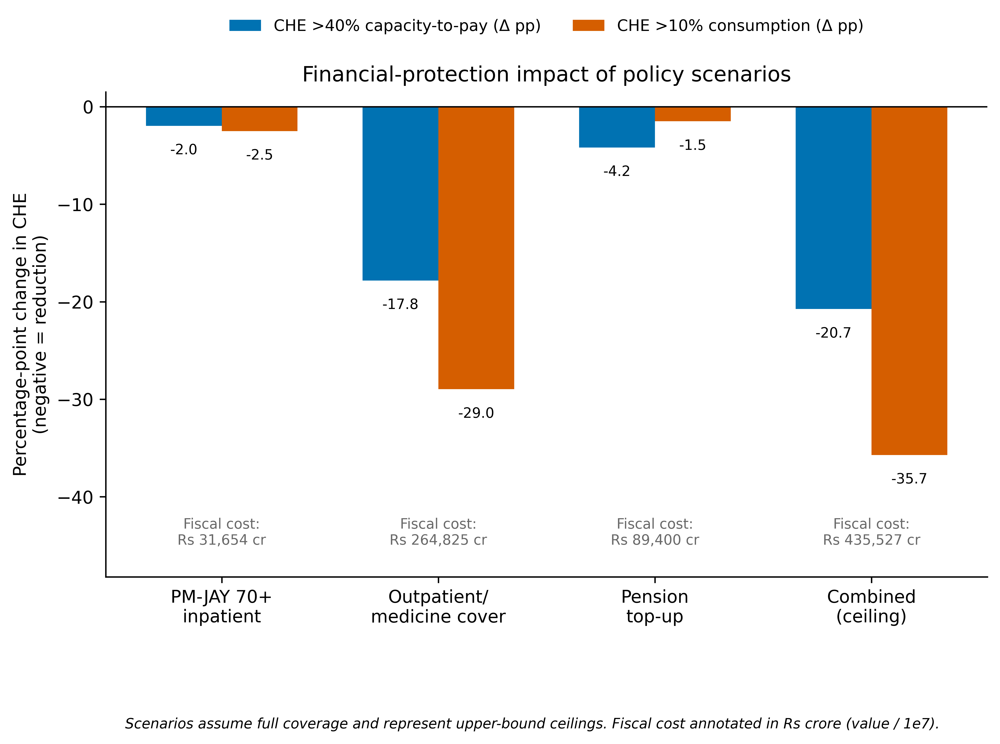
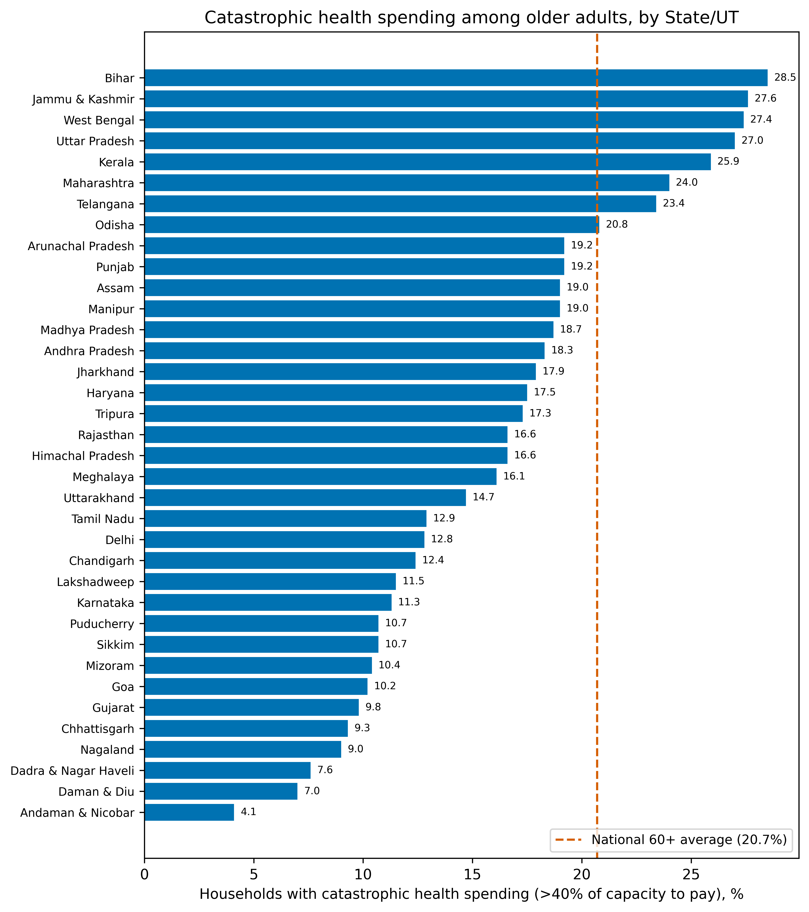
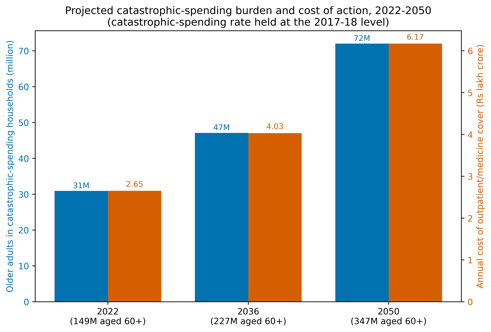
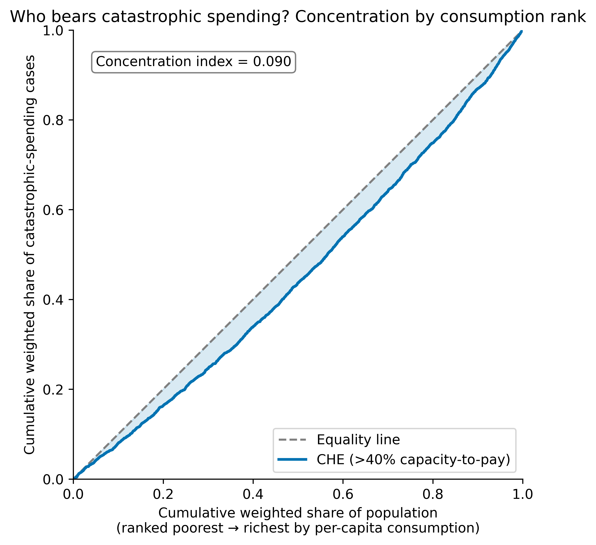
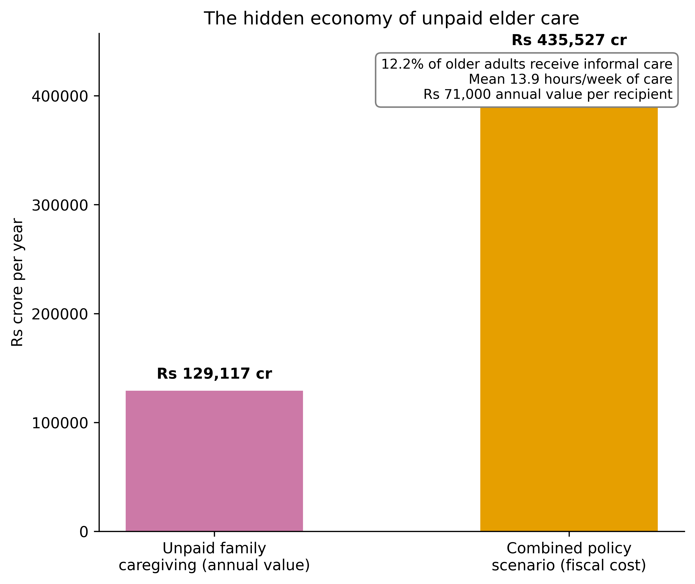

# Figures

All figures are survey-weighted and supplied at 600 dpi in the figures folder.

**Figure 1.** Catastrophic health expenditure among older adults at three thresholds, for all adults aged 60 yr and over and for those aged 70 yr and over.

**Figure 2.** Share of older adults below the poverty line before and after out-of-pocket payment, overall and by sex and residence.

**Figure 3.** Drivers of catastrophic spending ranked by mean absolute SHAP value from the gradient-boosting model (predictive, not causal).

**Figure 4.** Percentage-point change in catastrophic spending under four financing-reform scenarios, with each scenario's fiscal cost annotated. Scenarios assume full coverage and are upper-bound ceilings.

**Figure 5.** Ranking of States and union territories by the share of older households with catastrophic spending (>40% of capacity to pay). The dashed line marks the national 60+ average (20.7%).

**Figure 6.** Projected number of older adults in catastrophic-spending households and the annual cost of universal outpatient and medicine cover, 2022–2050, holding the 2017–18 rate constant.

---

**Supplementary Figure S1.** Concentration curve for catastrophic spending against cumulative population ranked by per-capita consumption.

**Supplementary Figure S2.** The economic value of unpaid family caregiving for older adults.

